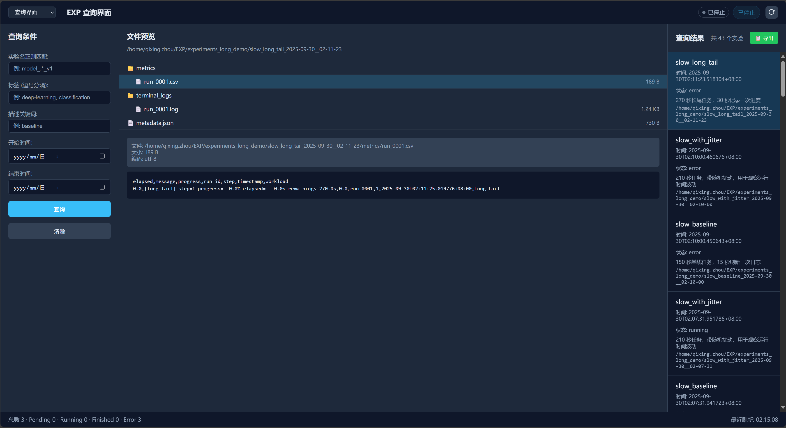

# 实验管理框架

一个轻量级的Python实验管理框架，提供：

🚀 **批量调度** - TOML 配置文件一键启动多组实验，支持优先级和并发控制  
📊 **指标记录** - 动态 CSV 管理，`upd_row()` + `save_row()` 数据库风格操作  
🌐 **可视化监控** - 配备 Web UI，实时查看实验状态和日志  
📱 **飞书同步** - 训练指标实时同步到多维表格，团队协作更便捷

<div align="center">
  
  <p><em>实验管理界面 - 批量调度与实时监控</em></p>
</div>

<div align="center">
  
  <p><em>实验查询页面 - 实验查询与内容预览</em></p>
</div>

## 🚀 快速上手

### 1. 安装

```bash
pip install -e .
```

### 2. 配置变量

#### 环境变量配置（可选）
创建 `.env` 文件管理环境变量：

```bash
# 交互式配置飞书环境变量
EXP set --preset lark
```

### 3. 单点实验运行

#### 最简示例
```python
from pathlib import Path
from experiment_manager.core import Experiment

# 创建实验
exp = Experiment(
    name="my_experiment",
    command="python train.py --epochs 10",
    base_dir=Path("./experiments")
)

# 记录指标
exp.upd_row(epoch=1, train_loss=0.5, val_acc=0.85)
exp.save_row()  # 保存到 CSV
# exp.save_row(lark=True) 可同步到飞书
```

#### 完整示例
```python
exp = Experiment(
    name="cnn_baseline",
    command="python train.py --epochs 100 --lr 0.001",
    base_dir=Path("./experiments"),    # 实验输出目录
    gpu_ids=[0, 1],                    # 指定GPU
    tags=["baseline", "cnn"],          # 标签
    cwd="./",                          # 工作目录
    description="基线CNN实验",          # 描述
    lark_config="https://example.feishu.cn/base/xxx?table=tblxxx"  # 飞书配置
)

# 训练循环
for epoch in range(10):
    # ... 训练代码 ...
    
    exp.upd_row(
        epoch=epoch,
        train_loss=train_loss,
        val_acc=val_acc,
        lr=current_lr
    )
    exp.save_row(lark=True)

# 分析结果
df = exp.load_metrics_df()
best_acc = df['val_acc'].max()
```

### 4. 批量调度器运行

#### 创建配置文件
创建 `config.toml`：

```toml
# 配置文件的完整写法参考 docs/example_config.toml

[scheduler]
max_concurrent_experiments = 2
base_experiment_dir = "./experiments"
linger_when_idle = true

[[experiments]]
name = "baseline"
command = "python train.py --epochs 10 --lr 0.001"
priority = 10
description = "基线实验"

[[experiments]]
name = "high_lr"
command = "python train.py --epochs 10 --lr 0.01"
priority = 5
description = "高学习率实验"
```

#### 运行调度器
```bash
# 查看计划
EXP run ./config.toml --dry-run

# 执行实验
EXP run ./config.toml

# 可视化监控（另开终端）
EXP see ./experiments
```

## License

This repository is licensed under the [Apache-2.0 License](LICENSE).

## Star History

